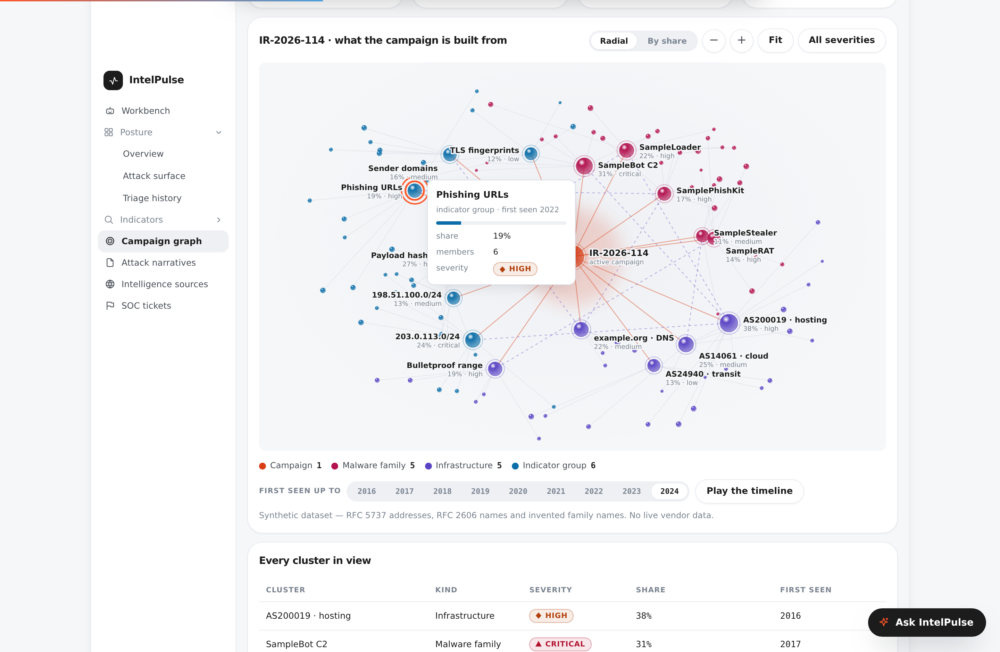
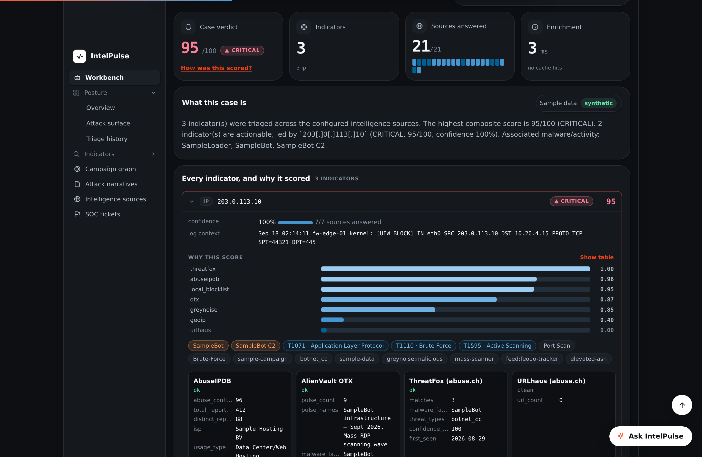
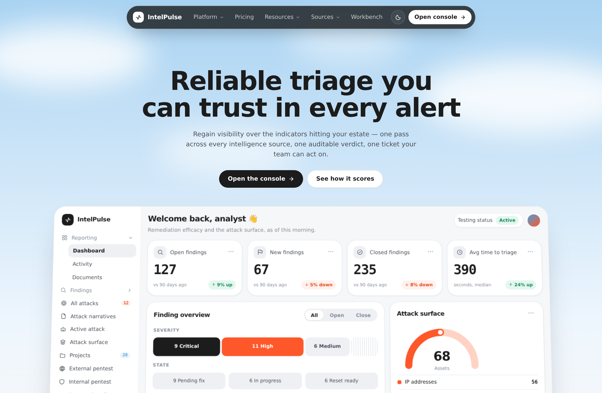
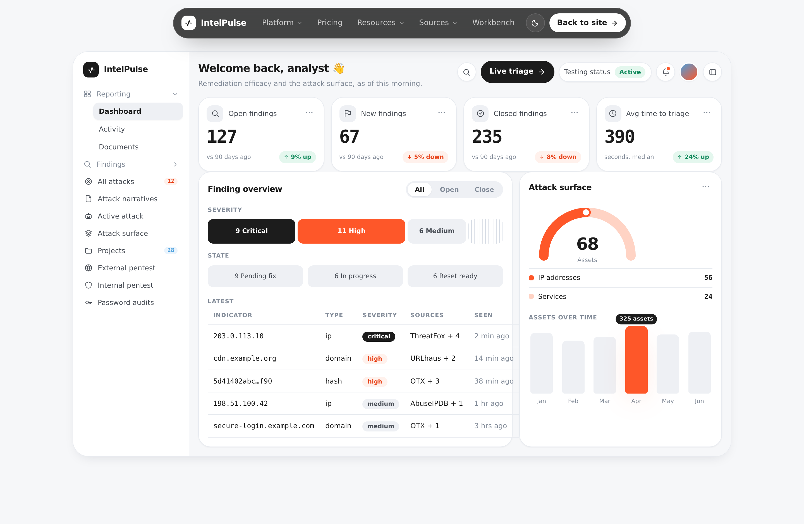
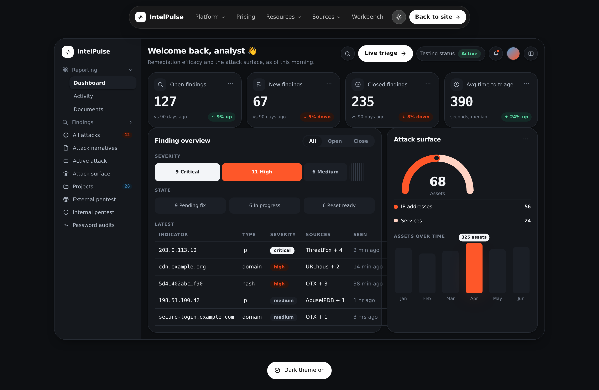
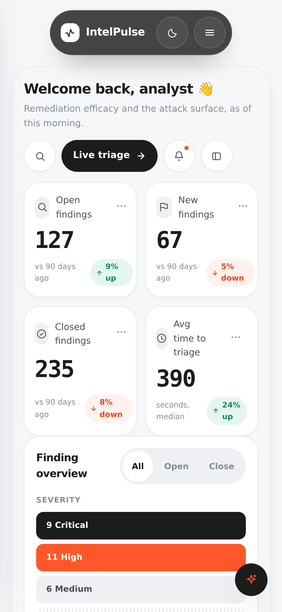
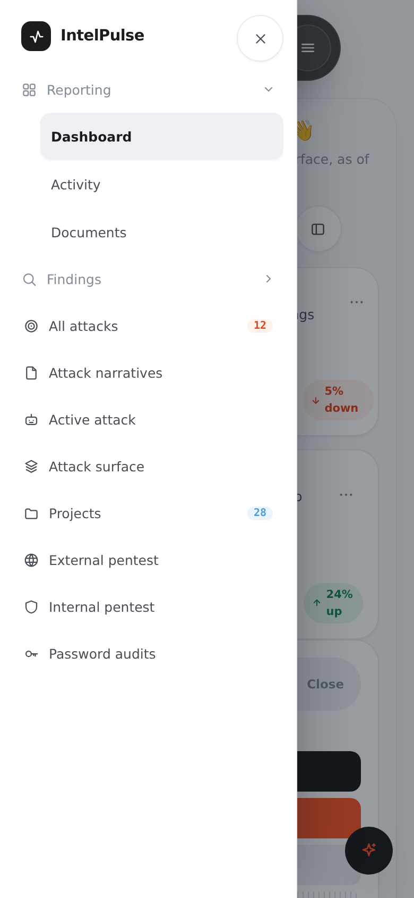
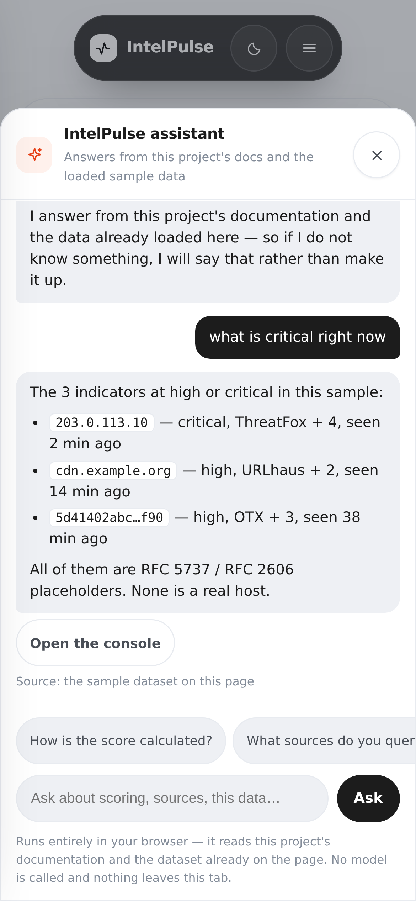
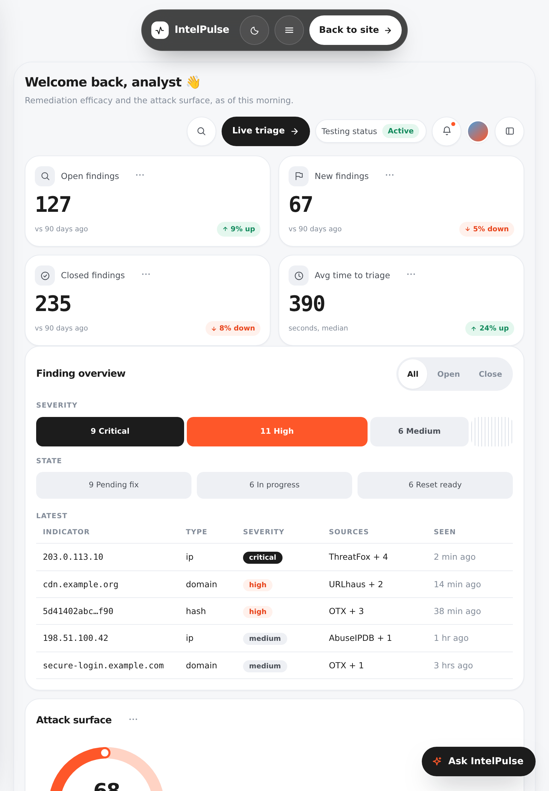
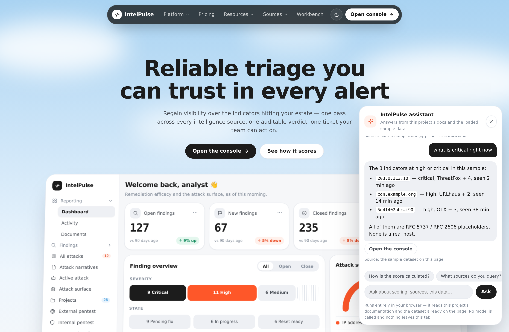

# IntelPulse — Automated Threat Intelligence & Triage Workbench

**Live demo:** https://vinitrami-soc.github.io/intelpulse/ · **API docs:** `/docs` once the backend is running

A SOC analyst opens six tabs for one alert: AbuseIPDB for the reputation, OTX for the campaign,
GreyNoise to check whether it is just Shodan again, ThreatFox and URLhaus for the payload, GeoIP/WHOIS
for the hosting. Six tabs × forty alerts a shift is where triage time goes — and where indicators get
missed.

IntelPulse does that pass in **one request**: it parses indicators out of whatever you paste (IOC list,
raw syslog, JSON alert export), queries every applicable source **concurrently**, scores them into a
single auditable verdict, maps the relationships between them, and writes the ticket — executive
summary, evidence, MITRE ATT&CK mapping and containment actions included.


<p align="center">
  
  
</p>

---

## What it actually does

| Capability | Detail |
| --- | --- |
| **Multi-format ingestion** | Plain IOC lists, firewall/proxy syslog, Windows EVTX-as-JSON, SIEM alert exports, `.log/.txt/.csv/.json` upload up to 5 MB. Defanged notation (`1.2.3[.]4`, `hxxp://`) is refanged; RFC1918/loopback/CGNAT space and filenames like `svchost.exe` are dropped before anything leaves the building. |
| **Parallel enrichment** | One `httpx.AsyncClient`, one task per (indicator × provider), a global semaphore, per-provider timeouts and `return_exceptions=True`: a dead vendor degrades the result instead of failing the request. |
| **Composite scoring** | A weighted mean of the sources that actually answered, floored by the most authoritative single hit, then modified by GreyNoise noise-filtering and analyst allow/block lists. Confidence is reported separately from score. [Full model →](docs/SCORING.md) |
| **Quota-aware caching** | Every provider response — including failures, at a shorter TTL — is cached by `(provider, ioc)` in Redis (24 h default). The same IP triaged three times in a shift costs one quota unit, not three. |
| **Offline datasets** | Feodo Tracker, FireHOL level 1, ThreatFox daily dump, CISA KEV and an NVD CVE slice are imported into Postgres/SQLite; MaxMind GeoLite2 resolves geo/ASN locally. The platform keeps working when the free API quotas run out or the box has no internet. |
| **Investigation graph** | Indicators, malware families, ASNs, countries, campaigns and payload hashes as an SVG graph drawn in the page, so "is this one thing or five things?" is answerable at a glance. |
| **SOC ticket output** | One click produces Markdown or JSON: severity + priority SLA, executive summary, per-indicator evidence with the rationale each source gave, ATT&CK techniques, and a containment checklist written as defender actions. |
| **Case history & audit** | Every triage is persisted with its full provider payload, so a report can be regenerated later and an auditor can see who ran what and when. |
| **Hardened by default** | Outbound host allowlist with resolution checks, per-endpoint rate limits, bounded payloads, security headers, JSON logs with credential masking, and a UI that treats every log line as hostile. [Full posture →](docs/SECURITY.md) |

---

## Architecture

```
                 ┌──────────────────────────────────────────────┐
  paste / upload │  Dashboard (static HTML/CSS/JS, no framework) │
  ──────────────▶│  demo mode: scores a bundled dataset in-page │
                 └───────────────┬──────────────────────────────┘
                                 │ REST (JSON)
                 ┌───────────────▼──────────────────────────────┐
                 │  FastAPI  ── /api/extract  /api/triage        │
                 │           ── /api/triage/report  /api/cases   │
                 │  ┌────────────────────────────────────────┐  │
                 │  │ ioc.py      regex + refang + RFC filter │  │
                 │  │ enrichment/ one class per source        │  │
                 │  │ scoring.py  weights, authority, modifiers│ │
                 │  │ graph.py    relationship builder        │  │
                 │  │ reporting.py Markdown / JSON ticket     │  │
                 │  └────────────────────────────────────────┘  │
                 └───┬──────────────┬─────────────┬─────────────┘
                     │              │             │
              ┌──────▼─────┐ ┌──────▼──────┐ ┌────▼─────────────┐
              │ Redis      │ │ PostgreSQL  │ │ Celery + beat    │
              │ quota cache│ │ cases,lists │ │ feed refreshes   │
              └────────────┘ │ feeds, CVEs │ └──────────────────┘
                             └─────────────┘
   live APIs: AbuseIPDB · AlienVault OTX · GreyNoise · ThreatFox · URLhaus
   offline:   MaxMind GeoLite2 · Feodo Tracker · FireHOL · CISA KEV · NVD
```

**Stack:** Python 3.12 · FastAPI · httpx (async) · SQLAlchemy 2.0 (async) · PostgreSQL/SQLite ·
Redis · Celery + beat · vanilla JS dashboard · Docker Compose.

**Dashboard:** one console, dense, in the shape analysts already know — the workbench, the campaign
graph and the posture views share one sidebar, every view has its own address (`#/console/workbench`),
the rail collapses and stays with you down a long page, and dark/light themes were each designed
against their own surface. The data-viz colours
are computed, not chosen: the evidence ramp passes the full ordinal gate on both surfaces, and
severity is encoded three times over (hue + glyph + text) because SOC semantics force red, orange and
amber to sit next to each other. No framework, no build step — three static files serve identically
from GitHub Pages, nginx or `python -m http.server`. [Design system →](docs/DESIGN.md)

---

## Quickstart

### Docker (everything, one command)

```bash
cp .env.example .env        # optional: paste any free API keys you have
docker compose up --build
# API       → http://localhost:8000/docs
# Dashboard → http://localhost:8080   (switch to "Live API" → http://localhost:8000)
```

No API keys? It still runs. Unconfigured providers report themselves as `skipped` in
`/api/health` and in every result — the platform never presents a missing source as a clean verdict.

Anywhere but your own machine, set `API_TOKEN` in `.env` and paste the same value into the
console's **API token** field when you connect; list your dashboard's address in `CORS_ORIGINS`.

### Local, without Docker

```bash
make install                 # venv + dependencies
make test                    # 200 tests, no network required
make dev                     # http://localhost:8000/docs

make seed                    # optional: bundled sample feed rows for an offline demo
make feeds                   # optional: import the real offline datasets (needs internet)
python -m http.server 8080 --directory web   # the dashboard
```

### Terminal triage

```bash
cd backend
python -m app.cli triage 185.220.101.34 --report     # prints a Markdown SOC ticket
python -m app.cli feeds --all                        # refresh every offline dataset
```

---

## API

| Method | Path | Purpose |
| --- | --- | --- |
| `POST` | `/api/extract` | Parse-only: see what would be triaged without spending a single API call |
| `POST` | `/api/triage` | Enrich every indicator in parallel, score, correlate, persist |
| `POST` | `/api/triage/upload` | Same, from a `.log/.txt/.csv/.json` file |
| `POST` | `/api/triage/report?fmt=markdown\|json` | Triage and return a ready-to-paste SOC ticket |
| `GET` | `/api/cases`, `/api/cases/{id}`, `/api/cases/{id}/report` | Case history and report regeneration |
| `GET`/`POST`/`DELETE` | `/api/lists` | Analyst allowlist / blocklist |
| `GET` | `/api/intel/feeds`, `POST /api/intel/feeds/{feed}/refresh` | Offline dataset status and refresh |
| `GET` | `/api/health`, `/api/scoring/model` | Which sources are live, and the exact weights behind a verdict |

Full reference with request/response examples: [docs/API.md](docs/API.md).

```bash
curl -s -X POST localhost:8000/api/triage \
  -H 'Content-Type: application/json' \
  -d '{"text":"SRC=185.220.101.34 blocked; hxxp://bad-domain[.]top/x.exe"}' | jq '.verdict, .score'
```

---

## The scoring model in one paragraph

Each source is normalised to a 0–1 signal. The engine then takes the **higher** of a weighted mean
(over the providers that actually answered, so a dead API cannot deflate a verdict) and an **authority
floor** (`max(signal × authority)`, so one confirmed abuse.ch C2 listing still reads *critical* when
five quieter sources shrug). Modifiers encode analyst judgement: GreyNoise `benign` — Shodan, Censys,
academic scanners — damps the score ×0.45; an allowlist entry forces 0; a blocklist entry forces ≥ 90.
**Confidence** is computed and displayed separately, because "85/100 from one source" and "85/100 from
five" are different instructions to an analyst. Weights are configuration, not code, and
`GET /api/scoring/model` returns them so any verdict can be audited.

Worked examples and the full rationale: [docs/SCORING.md](docs/SCORING.md).
Security controls and their tests: [docs/SECURITY.md](docs/SECURITY.md).
Design system, colour validation and interaction model: [docs/DESIGN.md](docs/DESIGN.md).

---

## Investigation graph and ticket output


The Markdown ticket is written to be pasted straight into Jira or ServiceNow: severity with a priority
SLA, an executive summary, the evidence each source gave in its own words, ATT&CK techniques, and a
containment checklist (`- [ ] Block the address at the perimeter firewall…`) scoped to the indicator
type and verdict. Indicators are defanged in the report so a ticket comment can never be click-through.

---

## Three pages, one dataset



<p align="center">
  
  
</p>

| Page | What it is |
| --- | --- |
| `web/index.html` | The site and the operator console — what a visitor lands on. A light, sky-gradient landing page that explains the correlation model, and a console route (`#/console`) with the posture metrics, severity split and attack-surface gauge. |
| `#/console/workbench` | The analyst tool, as a console view. Paste an alert, run the triage, read the evidence, open the graph, generate the ticket, switch between demo data and the live API. |
| `#/console/campaigns` | The campaign graph — one synthetic investigation drawn as a radial map, with a first-seen timeline and a severity filter. |
The workbench and the graph used to be separate pages, `web/workbench.html` and `web/explorer.html`,
with a look of their own. They are console views now, so they share the console's sidebar, header,
theme and type; the old addresses redirect. Everything shares the demo dataset and the scoring engine,
so a number shown on the landing page is the same number the workbench computes.

The landing page is deliberately a *page*, not an app shell: it has one accent colour, one typeface
pair, glass panels over a sky gradient, reveal-on-scroll for every section, a sources rail that scrolls
sideways on its own (and can be dragged, wheeled or arrow-keyed), and a theme button that wipes the new
theme in as a circle growing out of the button. All of it degrades to plain, still, readable layout
under `prefers-reduced-motion`.

**On a phone or tablet** the site nav becomes a drawer and the console rail slides in from the left,
both closing on a tap outside, on `Escape` and after you pick something. Every control clears the 44px
touch target on a coarse pointer, the severity bar stacks so its labels stay whole, and the headline
sizes against viewport height so a phone held sideways does not get one word per screen.

<p align="center">
  
  
  
  
</p>

**Ask it something.** The button in the corner opens a help assistant. It is not a chat bot: there is
no model behind it and no network call. It matches your question against topics compiled into the page
and computes the rest from the dataset already loaded, so it can explain the scoring formula, the
authority values, the verdict bands or the security controls — and tell you what is critical in the
current sample. Below its match threshold it says it does not know rather than inventing something,
which for a tool that explains how a security verdict was reached is the only acceptable behaviour.



---

## Using it

Open **Workbench** in the console sidebar, paste an alert (or pick one of the sample alerts) and run
it — <kbd>Ctrl</kbd>+<kbd>↵</kbd> or <kbd>⌘</kbd>+<kbd>↵</kbd> from the box does the same. In the
graphs, <kbd>Tab</kbd> reaches every node and <kbd>Enter</kbd> opens it; <kbd>Escape</kbd> closes the
scoring dialog and the graph readout.

Every indicator opens to show **why** it scored what it did: a contribution bar per source (with a
table view), the rationale each vendor gave in its own words, the modifiers that were applied, and a
**Scoring math** button that prints the actual arithmetic — weighted mean, authority floor, final
verdict. Nothing about a score is hidden behind the number.

## Demo mode vs live mode

The GitHub Pages deployment runs **demo mode**: `web/assets/engine.js` is a faithful port of the
backend's extraction, scoring and reporting modules, so the browser scores a bundled dataset with the
same weights, authority floor and verdict bands as the API. That dataset is **synthetic** — RFC 5737
documentation addresses and RFC 2606 reserved domains — and the UI says so on every screen and in
every generated report. Nothing in demo mode describes a real host, and no vendor API is called.

Switch the toggle to **Live API**, point it at a running backend, and the same screens are driven by
real AbuseIPDB / OTX / GreyNoise / abuse.ch responses.

---

## Testing

```bash
make test        # 200 backend tests: extraction (incl. the 3,400-line corpus), scoring,
                 # API contract, reports, security controls, the 2026 audit's regressions
make test-web    # 56 node tests: engine parity, console model, design-system guards
make test-ui     # Chromium: the workbench and graph suite (XSS, hostile URLs, degradation,
                 # evidence, both graphs, diffs, a11y) plus the site suite (every control, the
                 # side rail, routing) and the phone/tablet/assistant suite
make lint        # ruff
make audit       # pip-audit against the pinned requirements
```

All of it runs on every push and pull request that touches `intelpulse/`
(`.github/workflows/intelpulse.yml`) — the same commands, so a green run there
means what a green run in a terminal means. The three browser suites are a
matrix, so a failure names which surface broke rather than "browser tests".

`pip-audit` is deliberately **not** in that workflow. A new advisory against a
pinned dependency is worth knowing about, but it has nothing to do with whoever
opened the pull request that happened to run next, and blocking their change on
it is how people learn to ignore red. It runs weekly on its own schedule
instead (`.github/workflows/audit.yml`).

Provider classes are stubbed in the API tests, so assertions describe pipeline behaviour rather than
whatever AbuseIPDB happens to say today. The backend suite needs no network, no API keys and no Redis.
The browser-engine suite pins the JavaScript implementation to the same extraction rules, weights,
authority floor and verdict bands as the Python one, so demo mode cannot quietly drift away from the
real pipeline. The UI suite drives a real Chromium: it pastes `<script>`, `` and
`javascript:` payloads into the ingest field and asserts nothing executes, feeds the renderer a
hostile provider response and asserts the link is dropped, and kills the backend mid-request to check
the page degrades instead of freezing. It also drives the evidence charts, the scoring dialog (focus
in, `Escape`, focus back), both graphs by keyboard, the triage diff and the view's own lifecycle —
leave it and come back, and the draft is still there — and asserts zero horizontal overflow at
390 / 768 / 1024 / 1440px.

`web/tests/suite.spec.mjs` covers the site and console in front of it, and the rule it exists to
enforce is that **every control a visitor can see does something**: it enumerates every visible
button and link on both routes, clicks each one, and fails on any that leaves the page unchanged.
It also pins the side rail (auto-advance, pause under the cursor, drag both ways, seamless wrap),
the routing, the theme wipe and its persistence, the sign-up validation, and the scaled hero mock —
each of which broke at least once while the page was being built.

`web/tests/mobile.spec.mjs` covers phones and tablets across six viewports and the assistant panel.
It exists because the page reported zero horizontal overflow on a phone while the console's entire
main column was being laid out off-screen and clipped away, so it asserts the body actually covers the
screen rather than just checking for overflow. It measures every control against the 44px touch target,
checks both drawers open and close by tap, `Escape` and selection, and puts eighteen questions to the
assistant whose expected answers are facts that live in `backend/app` — so the panel cannot drift away
from the code without a test going red. It also pastes an `` into the question box and
asserts nothing becomes DOM.

---

## Security and honesty notes

Full detail, with the test that proves each control, is in [docs/SECURITY.md](docs/SECURITY.md);
the September 2026 OWASP audit — thirteen findings, each reproduced, fixed and pinned by a test — is
in [docs/SECURITY-AUDIT.md](docs/SECURITY-AUDIT.md). The short version:

* **Only your dashboard can write.** A `POST` or `DELETE` a browser sends from any origin not in
  `CORS_ORIGINS` is refused, because CORS alone never stopped a form post. Set `API_TOKEN` and every
  data route needs `Authorization: Bearer`; the audit log records who the server verified, not the
  name a client typed.

* **Egress is allowlisted.** Twelve known intelligence hosts, HTTPS only, resolution checked against
  private/loopback/link-local/metadata space on every hop including redirects. IntelPulse never
  fetches an analyst-supplied URL, and the allowlist means it never could.
* **Internal addresses never leave.** Private, loopback, link-local, CGNAT and documentation space is
  filtered during extraction, before any provider is called.
* **Quota and CPU are budgeted.** Per-client rate limits sized per endpoint (triage 30/min, writes
  60/min, reads 240/min), 1 MiB JSON bodies (counted as they stream, chunked or not), 5 MiB text-only
  uploads, 200 000 characters of text, 100 indicators per request, and extraction patterns that stay
  linear on hostile input. `X-Forwarded-For` is ignored unless explicitly trusted.
* **Logs are JSON and masked.** Request id, client, route, status, duration — with configured secrets
  and anything credential-shaped redacted from messages, arguments and tracebacks.
* **The UI treats every log line as hostile.** Output encoding everywhere, `http(s)`-only URL
  validation on links that come from providers, one normalising boundary for every result the API
  returns, validated browser storage, and a CSP that blocks inline script and
  `eval`. Tickets are escaped and defanged, so a title or a vendor string cannot write a section.
* **Dependencies are audited.** `make audit`; the pins moved forward when `pip-audit` found advisories
  in the originals.
* **Nothing is overstated.** Authentication is one shared token, not users and roles — the design
  target is a deployment behind the SOC's own boundary, and the roadmap says so. Unconfigured or failing sources are reported as
  `skipped`/`error`, never as "clean", and every report states its source coverage.
* Secrets live in `.env` only; the API container runs as an unprivileged user with a healthcheck.
* Containment guidance is defensive only: block, hunt, isolate, revoke, patch.

---

## Roadmap

- [ ] VirusTotal and Shodan providers (keys already read from config)
- [ ] STIX 2.1 / MISP export alongside Markdown and JSON
- [ ] Webhook ingestion so a SIEM can push alerts directly
- [ ] Per-analyst identity (OIDC) and roles for multi-user deployments; today it is one shared token
- [ ] Redis-backed rate limiting for multi-replica deployments (the interface is already one method)

---

Built by [Vinit Rami](https://vinitrami-soc.github.io/) — offensive-security background, defensive
engineering focus.
