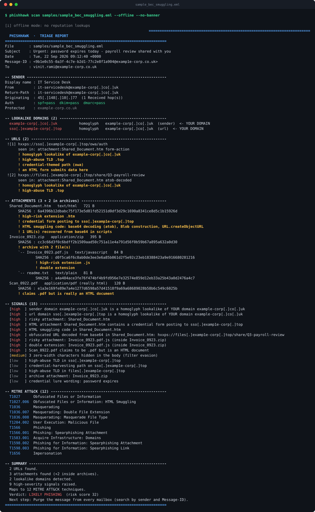
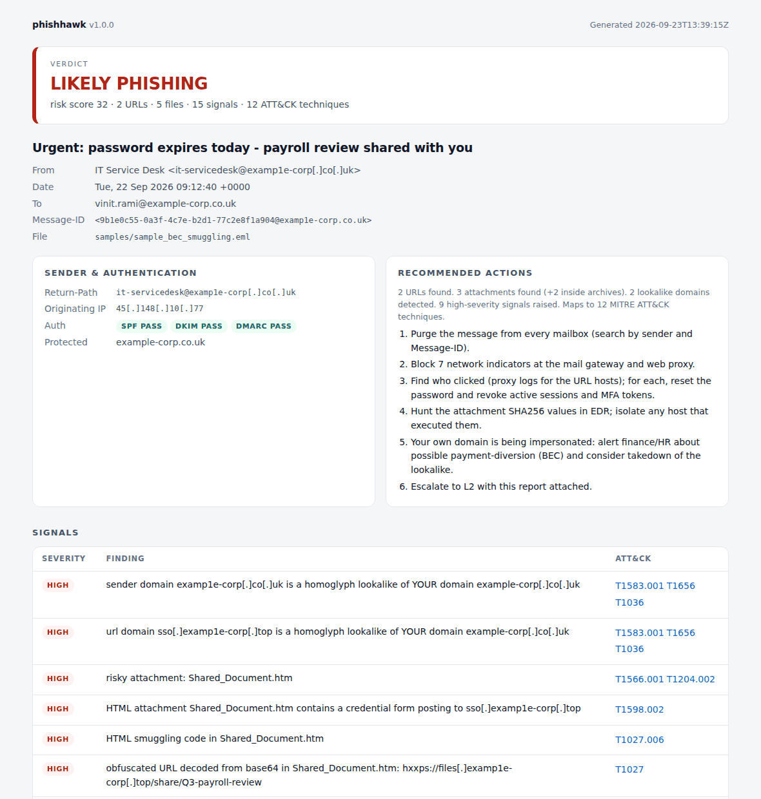

<p align="center">
  
</p>

<h1 align="center">PhishHawk</h1>
<p align="center"><b>Sharp-eyed phishing triage for the SOC.</b><br>
Extracts every indicator from a reported email, checks the ones that matter, maps them to MITRE ATT&CK
and tells the analyst what to do next.</p>

<p align="center">
  <a href="https://github.com/vinitrami-Soc/vinitrami-Soc.github.io/actions/workflows/phishhawk.yml"></a>
  
  
  
  
</p>


## Why

Phishing is the highest-volume ticket on an L1 queue, and most of the work is
mechanical: copy the headers, defang the links, hash the attachments, check
reputation, write the same summary, block the same kinds of indicators.
PhishHawk does that part in seconds, the same way every time, so the analyst
can spend their time on the part that needs judgement.

## A scan



<sub>Real, unedited runs: both images are captured from the CLI under a
pseudo-terminal by `python docs/make_demo.py`.</sub>

**SPF, DKIM and DMARC all pass** on this message. The attacker registered
`examp1e-corp.co.uk` (digit one, not letter L) and set up mail authentication
correctly, so a filter that trusts authentication lets it through. PhishHawk
still flags it: the sender is a homoglyph of the recipient's own domain, the
`.htm` attachment holds a credential form and HTML smuggling code, a base64
string in that code decodes to a second phishing URL, a ZIP carries
`Invoice_0923.pdf.js`, and `Scan_0922.pdf` is really an HTML file.

## Tested on real phishing

Offline, with no reputation lookups at all ([details and caveats](eval/README.md)):

| Data set | Emails | Flagged | False positives |
|---|---|---|---|
| Real phishing, **held-out** sample of the [phishing_pot](https://github.com/rf-peixoto/phishing_pot) honeypot corpus | 200 | **71.0%** | — |
| Real phishing, sample used while developing detections | 200 | 81.0% | — |
| Legitimate and edge-case mail (CPython email test corpus) | 48 | — | **2.1%** |
| Labelled synthetic corpus, including tricky legitimate mail | 167 | 100% | 0.0% |

The held-out number is the honest one: those 200 messages were scored once, at
the end. The honeypot labels a lot of plain spam (casino offers, diet pills) as
phishing too, and PhishHawk deliberately targets credential theft, malware
delivery, impersonation and BEC. Running real mail also found a 60-second
regex blow-up on one message, now under half a second, and cut false
positives from 12.5% to 2.1%. [eval/README.md](eval/README.md) has the full
story and the commands to reproduce every number.

## What it catches

| Area | Checks |
|---|---|
| **Reported mail** | Phish forwarded as an attachment is unwrapped, up to three layers. For a normal inline forward, the original `From:` is recovered from the quoted header block in English, Portuguese, Spanish, German, French and Italian. |
| **Sender** | Reply-To and Return-Path diversion; a brand in the display name that the domain does not back up, even when disguised as `Trust-Wallet`; organisation-style names on free-mail addresses; SPF, DKIM and DMARC results. |
| **Lookalike domains** | Homoglyphs (`micros0ft`, Cyrillic `а`, `rn` for `m`), punycode, typosquats, combosquats, TLD swaps and brands placed in subdomains. Checked against 66 brands and **your own domains**, which are taken from the recipients automatically. |
| **Links** | Taken from text, HTML `href`/`src`, form actions, `meta refresh`, JavaScript redirects, headers and PDF annotations (compressed streams included). Microsoft Safe Links, Proofpoint and Barracuda rewrites are unwrapped, and Google, Bing, Facebook, YouTube and LinkedIn redirectors are decoded. Also flagged: link-text/href mismatch, raw IPs, `@` tricks, shorteners, free hosting, tunnels, IPFS, file-sharing drops and credential-harvesting paths. |
| **Attachments** | Every file is typed by its magic bytes, so a `.pdf` that is really HTML counts as masquerading. Also flagged: double extensions, right-to-left-override names and risky types. ZIPs are listed and hashed in memory with zip-bomb caps; encrypted archives and VBA macro projects are flagged. |
| **HTML attachments** | Credential forms and where they post, smuggling code (`atob`, `Blob`, `createObjectURL`), redirects, and base64 strings that decode to URLs. |
| **Language** | Lure phrases in five languages (credential, delivery, payment, prize, advance-fee, extortion); callback-phishing (a fake renewal plus a phone number); QR-code lures; free-mail payment requests (BEC); letter-spaced text (`v e r i f y`); zero-width characters; hash-busting tokens; the recipient's address pasted into the subject or greeting. |

Every signal has a severity and the ATT&CK techniques it evidences. Low
signals add at most three points between them, so a missing auth header plus a
bounce domain never cries wolf. `SUSPICIOUS` needs a high signal or a score of
four; `LIKELY PHISHING` needs two high signals. A VirusTotal detection by two
or more engines makes the verdict `MALICIOUS`.

## Install

```bash
git clone https://github.com/vinitrami-Soc/vinitrami-Soc.github.io.git
cd vinitrami-Soc.github.io/phishhawk
./install.sh              # pipx if present, else a private virtualenv; no root needed
phishhawk doctor          # check Python, keys and cache before the first real run
```

The alternatives:

| How | Command |
|---|---|
| pipx / pip | `pipx install .` or, inside a virtualenv, `pip install .` |
| No install | `./phishhawk suspicious.eml` straight from the checkout |
| Docker | `docker build -t phishhawk .` then `docker run --rm -v "$PWD:/mail:ro" phishhawk suspicious.eml` |
| Uninstall | `./install.sh --uninstall` |

The container runs as an unprivileged user and works with `--network none`
for fully offline triage.

## Commands

```text
phishhawk scan PATH...     triage .eml files, folders or stdin ('-'); the default command
phishhawk doctor           check dependencies, API keys, cache (and --network reachability)
phishhawk cache stats      show the lookup cache; `cache clear [--provider rdap]`, `cache path`
phishhawk techniques       every MITRE ATT&CK technique PhishHawk can evidence (--json too)
phishhawk help scan        full help, with examples, environment variables and exit codes
```

```bash
phishhawk suspicious.eml                         # scan is the default command
phishhawk scan reported/ --quiet                 # a folder of reports, one summary each
cat suspicious.eml | phishhawk scan -            # from stdin
phishhawk scan mail.eml --offline                # nothing leaves the machine
phishhawk scan mail.eml --html r.html --stix iocs.json --md ticket.md --csv block.csv
phishhawk scan mail.eml --json - | jq .verdict   # pure JSON on stdout, notices on stderr
phishhawk scan mail.eml --protect example.com    # flag lookalikes of your domain
```

The banner goes to stderr and only appears on an interactive terminal
(`--no-banner` turns it off), so piped output stays clean. Output piped into
`head` exits quietly, and Ctrl+C exits with code 130.

| Environment | Meaning |
|---|---|
| `VT_API_KEY` | VirusTotal key; the free tier works |
| `ABUSEIPDB_API_KEY` | AbuseIPDB key for originating-IP reputation |
| `URLSCAN_API_KEY` | urlscan.io key, only needed for `--urlscan-submit` |
| `PHISHHAWK_PROTECT` | comma-separated domains to treat as your own |
| `NO_COLOR`, `PHISHHAWK_NO_BANNER` | plain output |

Exit codes: `0` nothing notable, `1` suspicious or likely phishing, `2`
malicious, `3` an input could not be read. Use them to gate a pipeline or a
mailbox-polling job.

## Reports

| Flag | For | Notes |
|---|---|---|
| *(default)* | The analyst | Colour terminal report; `--quiet` gives one block per mail, `--verbose` gives everything |
| `--html PATH` | The ticket, L2, a manager | Self-contained, light and dark themes. A strict Content-Security-Policy blocks scripts and network access, every value is escaped, and malicious URLs are never clickable |
| `--json PATH` | SOAR playbooks | Verdict, signals, techniques, indicators and actions. Message bodies are left out |
| `--stix PATH` | MISP, OpenCTI, Sentinel TI | STIX 2.1 bundle, validated against the official `stix2` library in CI. IDs are deterministic, so one URL reported by fifty users imports as one indicator |
| `--md PATH` | Jira, ServiceNow, TheHive | Ticket note with a defanged indicator table and an action checklist |
| `--csv PATH` | Blocklists and SIEM watchlists | Cells are protected against spreadsheet formula injection |

<picture>
  <source media="(prefers-color-scheme: dark)" srcset="docs/report-dark.png">
  
</picture>

Exports never emit known brand domains, your own domains, shorteners or
free-mail providers as domain-level blocks, because blocking `bit.ly` or
`google.com` would do more harm than the phish. The specific URL is still
exported, so a Google Drive drop link can be blocked without blocking Drive.

## Enrichment, and what leaves your machine

| Source | Key | What is sent | Default |
|---|---|---|---|
| VirusTotal | `VT_API_KEY` | URL id and file SHA256. **Files are never uploaded** | on when a key is set |
| urlscan.io | none (key only to submit) | Hostname only. `--urlscan-submit` sends the full URL as an *unlisted* scan, and only when you ask | search on |
| RDAP | none | The registered domain, to find its creation date. A domain registered this week is one of the strongest signals there is | on |
| AbuseIPDB | `ABUSEIPDB_API_KEY` | The originating IP | on when a key is set |

Protected domains and known brand domains are never sent anywhere. Lookups
are cached in SQLite (24-hour TTL, errors never cached). VirusTotal is paced
to the free tier's four requests a minute and capped per message, with
already-suspicious indicators looked up first.

## MITRE ATT&CK

`phishhawk techniques` lists all 18 techniques and what evidences each. Reports
list only the techniques seen in that message, each linked to the signals
behind it.

| Technique | Evidence |
|---|---|
| T1566.001 / .002 Spearphishing Attachment / Link | risky, archived or macro files; link-text mismatch; QR-code lures |
| T1598.002 / .003 Phishing for Information | credential forms in attachments; credential-harvesting paths |
| T1656 Impersonation | brand display names, Reply-To diversion, lookalikes of brands or your domain, free-mail BEC |
| T1036, .002, .007, .008 Masquerading | homoglyph hosts, RTL override, `invoice.pdf.js`, magic-byte mismatches |
| T1027, .006, .013 Obfuscation | letter spacing, zero-width text, base64 URLs, HTML smuggling, encrypted archives |
| T1583.001 / .006 Acquire Infrastructure | lookalike and new domains; free hosting, tunnels, IPFS, file sharing |
| T1608.005 Link Target, T1204.001 / .002 User Execution | shorteners, redirects, raw IPs; the files and links the lure pushes |

## Development

```bash
pip install -e ".[dev]"
pytest                               # 156 tests, offline, including the evaluation gate
ruff check src tests eval docs
python eval/run_eval.py --synthetic  # the labelled-corpus report
python docs/make_logo.py             # logo PNG + terminal banner art, from docs/logo.svg
python docs/make_demo.py             # README images, recorded from real runs
```

CI runs lint, the tests and CLI smoke tests on Python 3.10–3.13, installs and
uninstalls through `install.sh`, and builds and runs the Docker image with
`--network none`.

```text
src/phishhawk/
├── cli.py          scan / doctor / cache / techniques
├── banner.py       the start-up banner (_logo_art.py is generated from docs/logo.svg)
├── parse.py        MIME walk, unwrapping, inline forwards, archives, HTML and PDF attachments
├── extract.py      refang/defang, link unwrapping, URL/HTML/PDF extraction, magic bytes
├── lookalike.py    homoglyph / typosquat / combosquat / TLD-swap engine
├── heuristics.py   every signal, its severity and ATT&CK tags
├── hosting.py      free hosting, tunnels, IPFS and file-sharing links
├── knowledge.py    brands, lure phrases, TLDs, shorteners, free-mail, risky extensions
├── models.py       Analysis, indicators, scoring, IOC export policy
├── cache.py        SQLite TTL cache
├── enrich/         VirusTotal, urlscan.io, RDAP, AbuseIPDB
├── report/         console, HTML, STIX, Markdown, CSV
└── pipeline.py     parse → detect → enrich
eval/               labelled corpus generator, evaluation runner, real-corpus fetcher
```

## Limitations

- Outlook `.msg` files are not read; save them as `.eml`.
- QR codes are spotted from the lure wording, not decoded, so the URL inside
  one is not extracted.
- Only ZIP archives are opened. RAR, 7z and ISO are typed and flagged but not unpacked.
- `registrable_domain()` approximates the public suffix list.
- A VirusTotal "no record" means nobody has submitted the indicator yet, which
  for a URL usually means fresh infrastructure, not a clean one.
- Heuristics trade recall against false positives. Run `eval/run_eval.py`
  with `--benign` on your own legitimate mail before relying on it.

## Credits

Real-phishing evaluation uses [phishing_pot](https://github.com/rf-peixoto/phishing_pot)
by rf-peixoto (CC BY-NC 4.0), fetched on demand and never redistributed here.
Legitimate test mail comes from CPython's `test_email` data. Banner lettering
uses the figlet `basic` font.

Built by Vinit Rami, alongside an MSc dissertation on phishing detection. MIT licensed.
