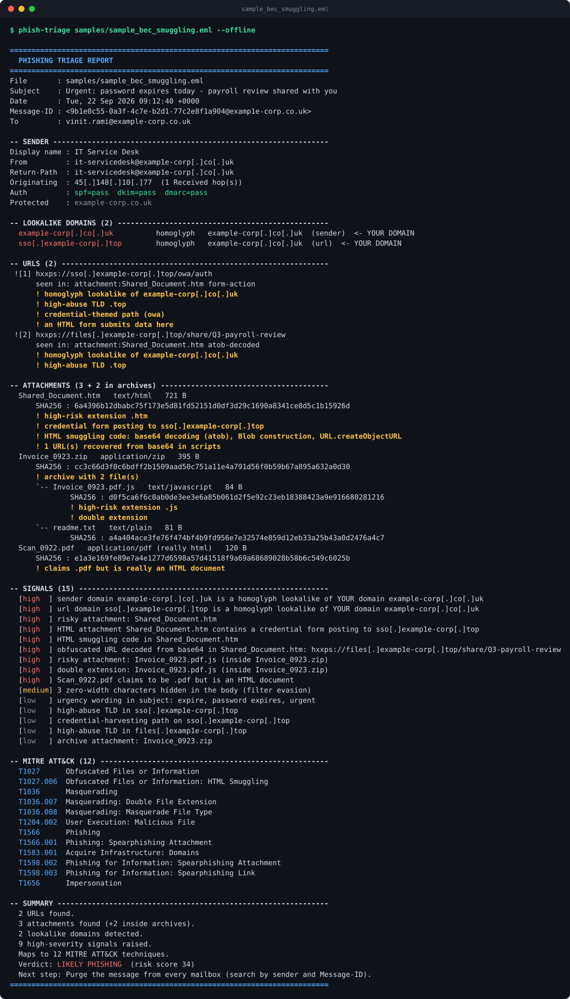
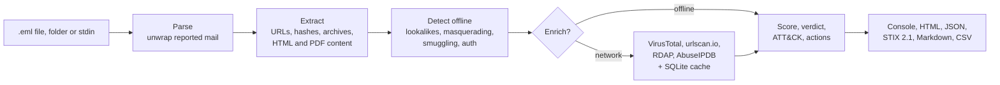
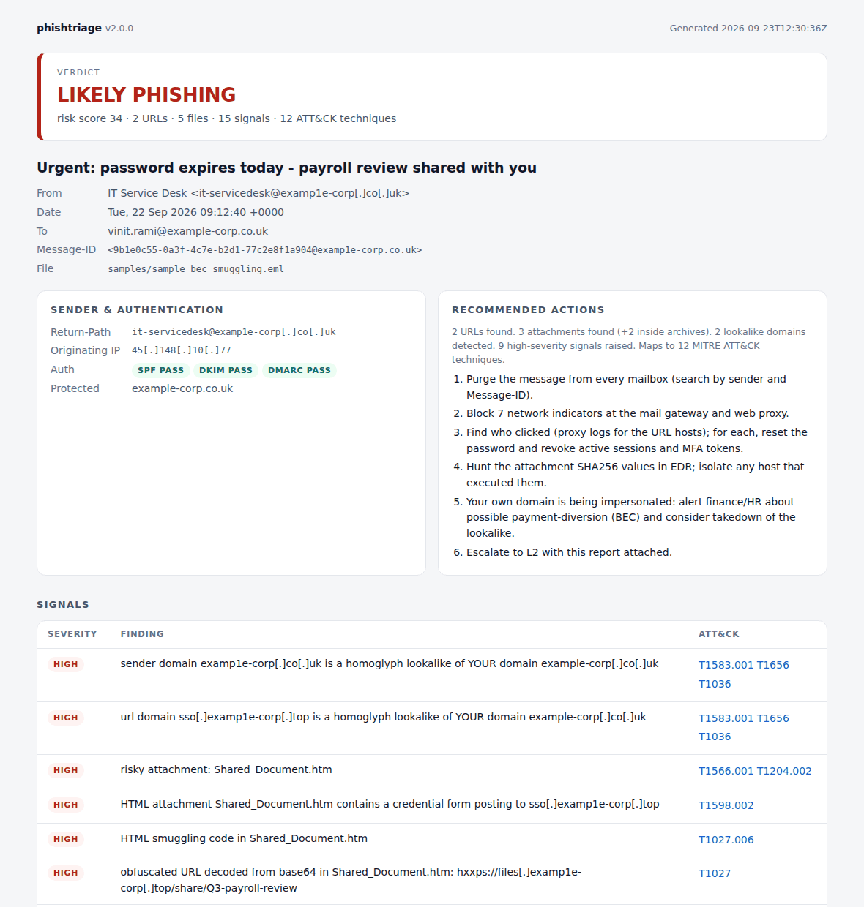

# phishtriage: automated phishing IOC and threat triage

[](https://github.com/vinitrami-Soc/vinitrami-Soc.github.io/actions/workflows/phishing-ioc-extractor.yml)


`phish-triage` takes a reported phishing email and does the first ten minutes
of L1 triage for you. It pulls out every indicator, checks the ones that matter
against VirusTotal, urlscan.io, RDAP and AbuseIPDB, maps what it finds to
MITRE ATT&CK, and hands back a verdict, a containment plan and the indicators
in whatever format the next system wants: terminal, HTML, JSON, STIX 2.1,
Markdown or CSV.



<sub>A real, unedited run. `docs/demo.svg` is captured from the CLI under a
pseudo-terminal by `python docs/make_demo.py`, so it cannot drift from what the
tool prints.</sub>

The run above is the interesting case. **SPF, DKIM and DMARC all pass**: the
attacker registered `examp1e-corp.co.uk` (digit one, not letter L) and set up
mail authentication properly. A filter that trusts authentication lets it
through. phishtriage flags it anyway, because the sender is a homoglyph of
*your own* domain, the `.htm` attachment holds a credential form and HTML
smuggling code, a base64 string in that code decodes to a second phishing URL,
a ZIP carries `Invoice_0923.pdf.js`, and `Scan_0922.pdf` is really an HTML file.

## Why

Phishing is the highest-volume ticket on an L1 queue, and most of the work is
mechanical: copy the headers, defang the links, hash the attachments, check
reputation, write the same summary, block the same kinds of indicators. This
tool does that part in seconds and consistently, which leaves the analyst the
part that needs judgement.

## What it catches

| Area | Checks |
|---|---|
| **Reported mail** | Users report phish by forwarding it *as an attachment*. The attached original is unwrapped (up to three layers) and analysed; the reporter is recorded separately. Without this, the sample above would read "no strong indicators". |
| **Sender** | Reply-To and Return-Path diversion, a brand in the display name that the domain does not back up, a different address hidden in the display name, SPF/DKIM/DMARC failures |
| **Lookalike domains** | Homoglyphs (`micros0ft`, Cyrillic `а`, `rn`→`m`), punycode, typosquats (edit distance), combosquats (`dhl-parcel-tracking.top`), TLD swaps, brand-in-subdomain (`microsoft.com.account-verify.top`). Checked against 36 major brands **and your own domains** |
| **URLs** | Taken from text, HTML `href`/`src`, form actions, `meta refresh`, JavaScript redirects and headers. Link-text/href mismatch, raw-IP hosts, `@` userinfo tricks, shorteners, high-abuse TLDs, credential-harvesting paths |
| **Attachments** | Every file is typed by its magic bytes (`.pdf` that is HTML → masquerading), plus double extensions, RTL-override names and risky types |
| **Archives** | ZIPs are listed and every member is hashed in memory, never written to disk, with zip-bomb caps. Password-protected archives are flagged; Office files are checked for VBA macro projects |
| **HTML attachments** | Credential forms and where they post, smuggling code (`atob`, `Blob`, `createObjectURL`), redirects, and base64 strings that decode to URLs |
| **PDF attachments** | Link annotations (uncompressed objects) |
| **Body** | Zero-width characters used to slip past keyword filters (while leaving Devanagari and Persian ZWJ/ZWNJ alone) |

Every signal has a severity and the ATT&CK techniques it evidences. The
weighted score gives a verdict: `NO STRONG INDICATORS`, `SUSPICIOUS`,
`LIKELY PHISHING` or `MALICIOUS`. A VirusTotal detection by two or more engines
forces `MALICIOUS`. One engine alone counts as suspicious, the same bar most
SOCs use.

## Pipeline



## Quick start

```bash
cd phishing-ioc-extractor
pip install .                                   # or: pip install -e ".[dev]"

phish-triage suspicious.eml                     # full report in the terminal
phish-triage reported/ --quiet                  # batch a folder, one summary each
phish-triage suspicious.eml --offline           # nothing leaves the machine
cat suspicious.eml | phish-triage -             # read from stdin

export VT_API_KEY=...                           # free: virustotal.com/gui/my-apikey
export ABUSEIPDB_API_KEY=...                    # free: abuseipdb.com/account/api
phish-triage suspicious.eml --html report.html --stix iocs.stix.json --md ticket.md
```

No install at all: `python phishing_ioc_extractor.py suspicious.eml` runs from
the checkout.

With Docker, as an unprivileged user, with the mail mounted read-only:

```bash
docker build -t phishtriage .
docker run --rm -v "$PWD:/mail:ro" -e VT_API_KEY phishtriage suspicious.eml
docker run --rm --network none -v "$PWD:/mail:ro" phishtriage suspicious.eml --offline
```

## Outputs

| Flag | For | Notes |
|---|---|---|
| *(default)* | The analyst | Colour terminal report; `--quiet` for one block per mail, `--verbose` for everything |
| `--html PATH` | The ticket, L2, a manager | Self-contained, light/dark. A strict Content-Security-Policy blocks all scripts and network access, every value is escaped, and malicious URLs are never clickable |
| `--json PATH` | SOAR playbooks | Everything, including verdict, techniques, indicators and actions. `--json -` prints pure JSON to stdout; notices go to stderr |
| `--stix PATH` | MISP, OpenCTI, Sentinel TI | STIX 2.1 bundle (indicators, ATT&CK attack-patterns, report), validated against the official `stix2` library in CI. Ids are deterministic, so the same URL reported by fifty users imports as one indicator |
| `--md PATH` | Jira, ServiceNow, TheHive | Ticket note with findings, a defanged indicator table and an action checklist |
| `--csv PATH` | Blocklists, SIEM watchlists | One indicator per row. Cells are protected against formula injection, since a subject line of `=HYPERLINK(...)` would otherwise run in Excel |

<picture>
  <source media="(prefers-color-scheme: dark)" srcset="docs/report-dark.png">
  
</picture>

Indicator exports deliberately leave some things out: known brand domains (the
decoy `login.microsoftonline.com` link in a spoof), your own domains,
shorteners and free-mail providers are never emitted as domain-level blocks.
Blocking `bit.ly` or `gmail.com` company-wide would do more harm than the phish.
The specific URL or address is still exported.

## Enrichment, and what leaves your machine

| Source | Key | What is sent | Default |
|---|---|---|---|
| VirusTotal | `VT_API_KEY` (free) | URL id (base64url of the URL) and file SHA256. **Files are never uploaded** | on when a key is set |
| urlscan.io | none to search; `URLSCAN_API_KEY` to submit | Hostname only. `--urlscan-submit` sends the full URL as an *unlisted* scan; that is opt-in | search on |
| RDAP | none | The registered domain, to find its creation date. A domain registered this week is one of the strongest phishing signals | on |
| AbuseIPDB | `ABUSEIPDB_API_KEY` (free) | The originating IP | on when a key is set |

* **Protected domains are never sent anywhere.** Recipient domains are protected
  automatically (free-mail excluded). Add others with `--protect example.com`
  or `PHISHTRIAGE_PROTECT=a.com,b.com`. Known brand domains are skipped as well.
* **Lookups are cached** in SQLite (`~/.cache/phishtriage/`, 24 h TTL), so
  re-running a campaign that hit fifty inboxes costs one lookup per indicator.
  Only definitive answers are cached, never errors or rate limits.
* **Quota-aware.** VirusTotal is paced to its free tier (4 per minute), capped
  per message (`--vt-budget`, default 20), and already-suspicious indicators are
  looked up first.
* 404, 429, 401 and network failures are reported as data ("no record",
  "rate limited") and never crash a batch run.

## MITRE ATT&CK coverage

| Technique | Evidence the tool looks for |
|---|---|
| T1566.001 Spearphishing Attachment | Risky, archived, macro-enabled or VT-flagged attachments |
| T1566.002 Spearphishing Link | Link-text/href mismatch, VT-flagged URLs |
| T1598.002 / .003 Phishing for Information | Credential forms in HTML attachments, credential-harvesting URL paths |
| T1656 Impersonation | Brand display names, Reply-To diversion, lookalikes of brands or of your domain |
| T1036 Masquerading, .002 RTL Override, .007 Double Extension, .008 Masquerade File Type | Homoglyph hosts, `@` tricks, `‮` names, `invoice.pdf.js`, magic-byte mismatches |
| T1027 Obfuscation, .006 HTML Smuggling, .013 Encrypted/Encoded File | Zero-width text, base64-decoded URLs, smuggling code, password-protected archives |
| T1204.001 / .002 User Execution | Links and files the recipient is lured into opening |
| T1583.001 Acquire Infrastructure: Domains | Lookalike, punycode, high-abuse-TLD and newly registered domains |
| T1608.005 Stage Capabilities: Link Target | Shorteners, raw-IP hosts, redirects |

Reports list only the techniques evidenced in that message, each linked to the
signals behind it. SPF/DKIM/DMARC results are supporting evidence, not a
technique: they decide whether the spoof was blocked or delivered.

## Exit codes

`0` nothing notable, `1` suspicious or likely phishing, `2` malicious, `3` an
input could not be read. This lets it gate a pipeline or a mailbox-polling job.

## Samples

`samples/` holds four inert fixtures, regenerated byte-for-byte by
`samples/make_samples.py`. The domains resolve nowhere and the "payloads" are
text comments:

| File | Scenario | Verdict |
|---|---|---|
| `sample_phish.eml` | Microsoft spoof: failing auth, homoglyph sender, decoy link, shortener, raw-IP link, `.pdf.html` attachment | LIKELY PHISHING |
| `sample_bec_smuggling.eml` | Lookalike of the recipient's own domain with passing auth, HTML smuggling, credential form, ZIP with `.pdf.js`, fake PDF | LIKELY PHISHING |
| `sample_reported.eml` | A colleague's "FW:" with the phish attached, which is what a SOC mailbox actually receives | LIKELY PHISHING |
| `sample_benign.eml` | Clean internal invoice notice, there to prove the tool does not cry wolf | NO STRONG INDICATORS |

## Development

```bash
pip install -e ".[dev]"
pytest            # 103 tests, fully offline
ruff check src tests
```

CI runs lint, the tests and a CLI smoke test on Python 3.10–3.13, then builds
the Docker image and runs it with `--network none`. API clients are tested
against recorded response shapes through fake sessions, so the suite needs no
keys and no network.

```
src/phishtriage/
├── parse.py        MIME walk, unwrapping, archives, HTML/PDF attachments
├── extract.py      refang/defang, URL + HTML + PDF extraction, magic-byte typing
├── lookalike.py    homoglyph / typosquat / combosquat / TLD-swap engine
├── heuristics.py   signals, severities, ATT&CK tags
├── knowledge.py    brands, TLDs, shorteners, free-mail, risky extensions
├── models.py       Analysis, indicators, verdict, IOC export policy
├── cache.py        SQLite TTL cache
├── enrich/         virustotal, urlscan, rdap, abuseipdb (+ shared base)
├── report/         console, html, stix, markdown, csvout, common
├── pipeline.py     parse → detect → enrich
└── cli.py          phish-triage
```

## Limitations and roadmap

- Outlook `.msg` files are not supported yet. Save them as `.eml` first.
- Only ZIP archives are opened. RAR, 7z and ISO are flagged by type but not
  unpacked, and neither is a ZIP nested inside a ZIP.
- PDF link extraction reads uncompressed objects only; links inside compressed
  object streams are missed.
- QR codes in images ("quishing") are not decoded.
- `registrable_domain()` approximates the public suffix list with a table of
  common two-label suffixes.
- A VirusTotal "no record" means nobody has submitted the indicator yet. For a
  URL that points to fresh infrastructure, not to a clean one.

Built alongside my MSc dissertation on phishing detection.
